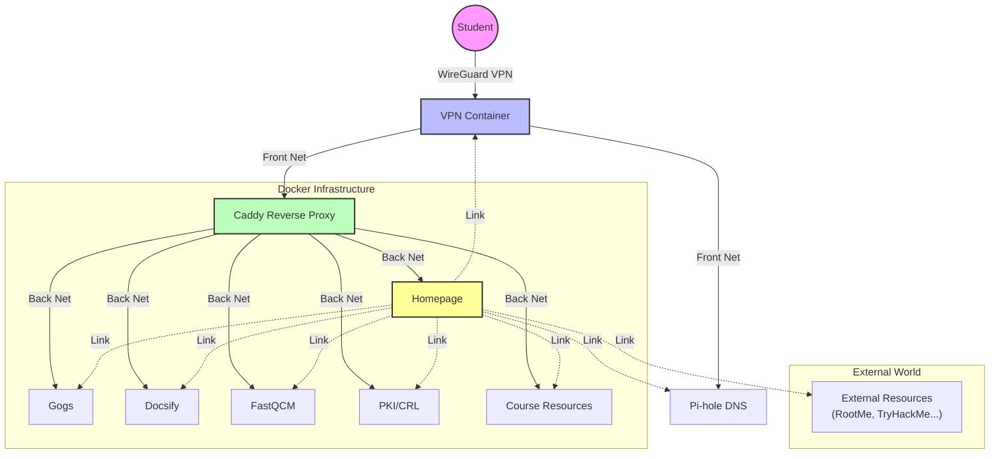

# Peryton 🛡️

**Cybersecurity Education and Simulation Platform**

Peryton is a complete "Infra-as-Code" (IaC) infrastructure designed to provide a secure, isolated, and automated learning environment for cybersecurity students.


## 🎯 Motivation

Peryton was created to address a critical need in cybersecurity education: providing a unified platform that allows students to practice in an environment that is:
*   **Dedicated**: Each instance is autonomous and isolated.
*   **Secure**: Resource access is strictly controlled via VPN.
*   **Automated**: Rapid deployment and simplified access management (automated credential emailing).

## ✨ Key Features

*   **Secure VPN Access**: Native WireGuard integration for encrypted access to internal services.
*   **Partitioned Infrastructure**: Strict network segmentation between front-end services (exposed to VPN) and back-end services (isolated), mimicking real-world enterprise architecture.
*   **Advanced Automation**:
    *   **Ansible Deployment**: Full configuration of servers, firewalls (UFW), and containers via playbooks.
    *   **Student Onboarding**: Automated generation and emailing of VPN configurations and personal credentials.
*   **Integrated Tool Suite**: A complete ecosystem for development, documentation, and assessment.

## 🛠️ Included Services

The infrastructure deploys and orchestrates the following services via Docker:

| Service | Description | Access (Internal) |
| :--- | :--- | :--- |
| **Homepage** | Centralized dashboard for accessing all tools. | `https://homepage.cyber` |
| **Gogs** | Self-hosted Git server for code versioning and project submission. | `https://gogs.cyber` |
| **Docsify** | Technical documentation platform for courses and labs. | `https://doc.cyber` |
| **Fast-QCM** | Automated assessment and quiz system. | `https://qcm.cyber` |
| **WireGuard** | VPN server with web management interface (wg-easy). | `https://vpn.cyber` |
| **PKI/CRL** | Root CA download and Certificate Revocation List. | `http://crl.cyber` |
| **Pi-hole** | DNS server and ad blocker for internal name resolution (`.cyber`). | N/A |
| **Caddy** | Reverse proxy handling routing and TLS termination. | N/A |

## 🏗️ Architecture

The diagram below illustrates the platform's network architecture, highlighting the separation between the Front Net and the internal Back Net.



## 🚀 Quick Start

### Prerequisites
*   A Linux server (Ubuntu/Debian recommended).
*   Ansible installed on the control machine.
*   Root or sudo access on the target server.

### Installation

1.  **Clone the repository:**
    ```bash
    git clone https://github.com/laulin/peryton.git
    cd peryton
    ```

2.  **Configure inventory:**
    *   Edit the `hosts` file to add your server's IP address.
    *   Create or edit the variable file in `host_vars/your-domain.yml` to set up all necessary variables (passwords, domains, etc.).

3.  **Run deployment:**
    Execute the Ansible playbook to install dependencies, configure security, and launch containers.
    ```bash
    ansible-playbook -i hosts playbook.yml
    ```

4.  **Distribute credentials:**
    Use the `send_credentials` role to automatically email VPN configurations to students.

## 📚 Documentation

More detailed documentation is available in the `docs/` folder:

*   [Architecture](docs/architecture.md): Detailed overview of the platform architecture and deployment flow.
*   [Usage Guide](docs/usage.md): Comprehensive guide on how to configure and use the platform.
*   [Roles & Variables](docs/roles.md): Reference for all Ansible roles and their configuration.


---
*Designed with ❤️ by Laulin for training future security experts, with the support of Spartan conseil*